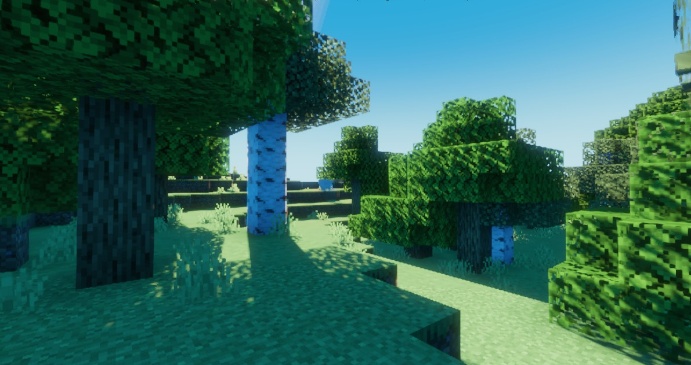

# kiwi-shader-be

A minimal shader for the deferred pipeline of Minecraft BE.

This is just an experimental shader. It does **not** focus on realism or features.
It is also **not** a lightweight shader.

### Code completion and error check
Clangd can be used to get code completion and error checks for source files inside `include/kiwi`.
Fake bgfx header (incomplete - only includes features used by Kiwi) and `.clangd` config are provided for the same.
This is an inefficient approach, but it is better than nothing.
- Neovim (NvChad):
  - Install `clangd` from Mason.
  - That's pretty much it. You can now start editing the source.
- VSCode: (*not tested)
  - Install [vscode-clangd](https://marketplace.visualstudio.com/items?itemName=llvm-vs-code-extensions.vscode-clangd) extension.
  - If it still doesn't work, make sure that clangd is loading the `.clangd` config file in the base directory.
> If clangd shows an error incorrectly, then you have to edit `.lsp/bgfx.h` and add those bgfx uniforms, functions, or data structures that are missing from my fake bgfx header.

### File structure
Kiwi Shader has its code separated into different files for better organization and LSP support. It might seem a little daunting at first, but it will help in the long run.
```
├─ .lsp
│  └─ bgfx.h      <- fake bgfx header for lsp
├─ include
│  └─ kiwi        <- kiwi shader files
│     ├─ funtions
│     │  └─ ..
│     └─ samplers
│     │  └─ ..
│     └─ uniforms
│     │  └─ ..
│     └─ deferred_f.h
│     └─ ...
├─ src            <- actual material source (kiwi functions are imported here)
│  └─ ...
└─ .clangd        <- clangd project config
```

### Building
No instructions are provided as of now because the shader is not in a usable state.

### Supported platforms
Kiwi Shader is currently being developed for Android (MCBE Beta 1.20.70+), but support for other platforms like Windows will be added in the future.

### Screenshots
Kiwi Shader currently looks like this, but will change considerably overtime.

